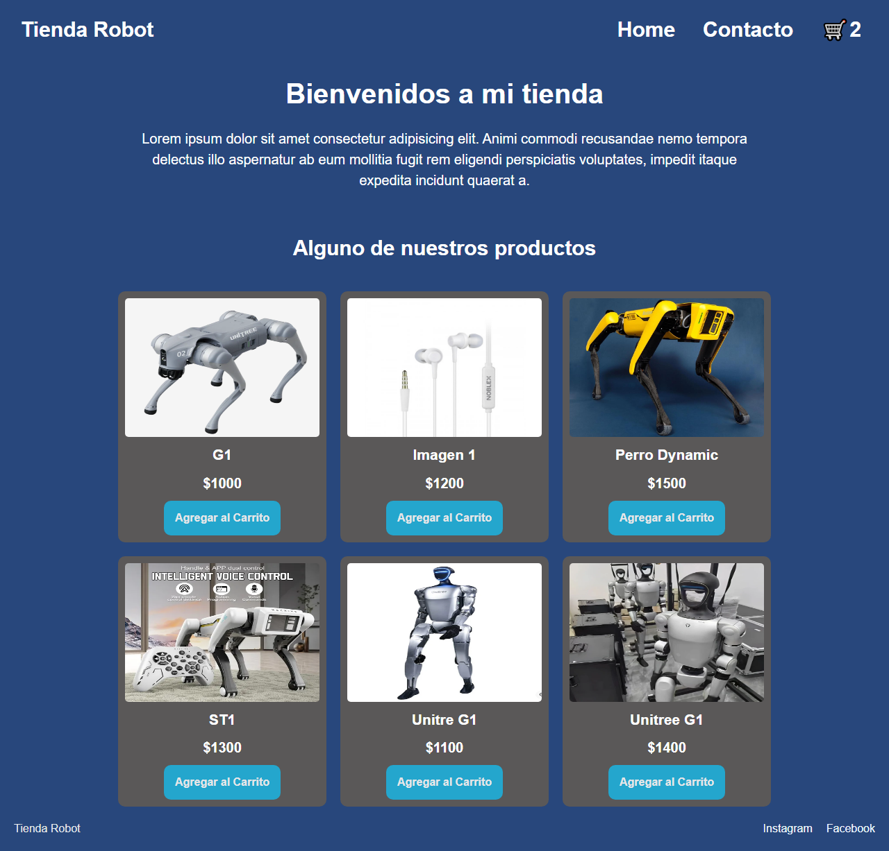
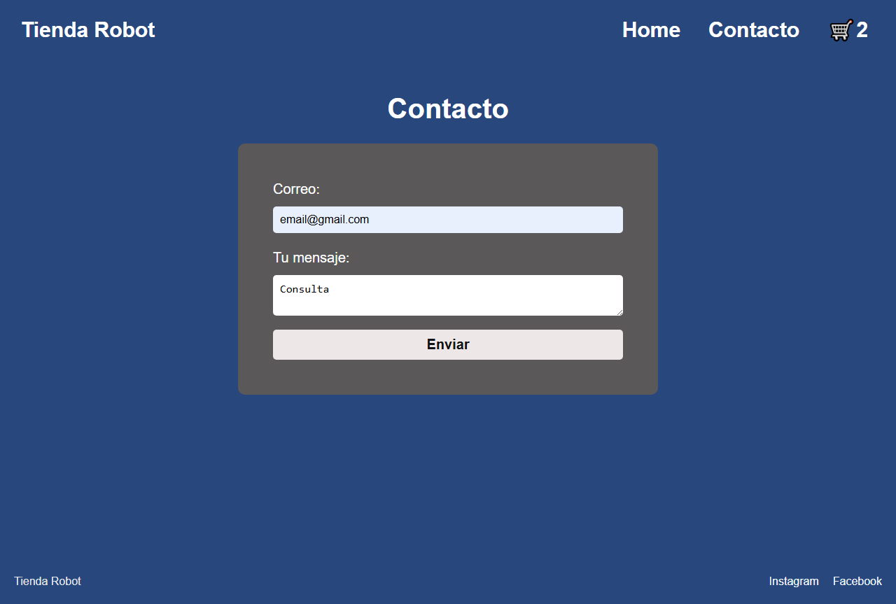
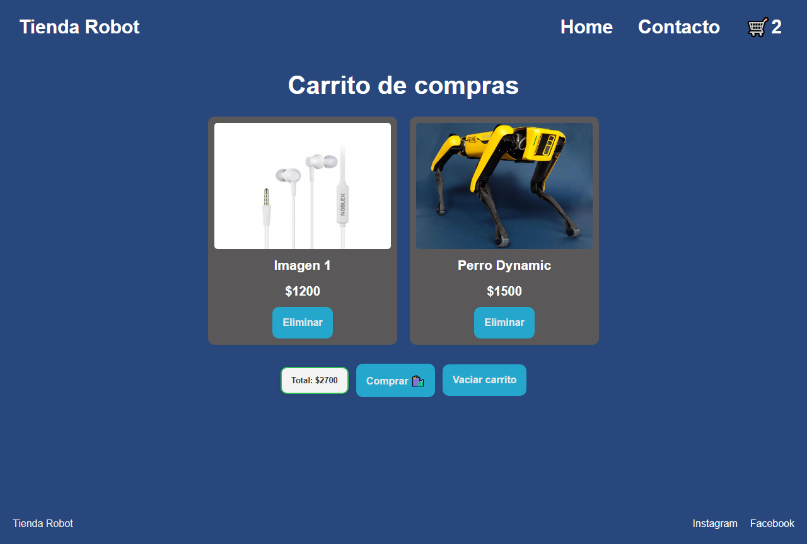

# 🤖 Tienda Robot — Proyecto Obligatorio de E-commerce

## 🛍️ Descripción General

**Tienda Robot** es un proyecto de **e-commerce** desarrollado como trabajo obligatorio del curso **Front End - Talento Tech**.  
El sitio simula una tienda de robots capaces de realizar diversas tareas domésticas y de oficina.

Cuenta con tres páginas principales:

- 🏠 **Inicio (`index.html`)** → Catálogo dinámico de productos.  
- 📞 **Contacto (`pages/contacto.html`)** → Formulario funcional con validación y envío mediante **Formspree**.  
- 🛒 **Carrito (`pages/carrito.html`)** → Carrito de compras interactivo con persistencia mediante **LocalStorage**.

El proyecto combina **HTML5 semántico**, **CSS responsivo** y **JavaScript modular** para brindar una experiencia moderna y funcional.

---

## 📁 Estructura del Proyecto

---

## 🧱 1. Estructura HTML

El sitio utiliza una estructura **semántica y accesible** con etiquetas HTML5:

- `<header>` → Logo y menú de navegación.  
- `<nav>` → Enlaces a Inicio, Contacto y Carrito.  
- `<main>` → Contenido principal (productos).  
- `<section>` → Agrupación de elementos relacionados.  
- `<footer>` → Redes sociales y derechos de autor.

---

## 💬 2. Formulario de Contacto

Ubicado en **`pages/contacto.html`**

Incluye:
- Campos de **nombre**, **correo electrónico** y **mensaje**.  
- Integración con **Formspree** para envío real.  
- Validación de campos mediante **JavaScript**.

📸 **Vista del formulario de contacto:**  

---

## 🛒 3. Carrito de Compras

Ubicado en **`pages/carrito.html`**

- Permite **agregar, eliminar y vaciar** productos.  
- Guarda los datos en **LocalStorage** para mantener el estado entre sesiones.  
- Calcula y muestra el **total del carrito** en tiempo real.  

📸 **Vista del carrito de compras:**  

---

## 🎨 4. Estilos con CSS

Archivo principal: `css/style.css`

Incluye:
- Diseño moderno con **Flexbox** y **Media Queries**.  
- Tipografía importada desde **Google Fonts**.  
- Componentes con **bordes redondeados**, **sombras suaves** y **efectos hover**.  
- Adaptabilidad total para dispositivos móviles, tablets y desktop.

---

## ⚙️ 5. Interactividad con JavaScript

El comportamiento dinámico del sitio se gestiona con scripts modulares:

- `productos.js` → Simula una API de productos.  
- `funcionesCarrito.js` → Lógica principal del carrito (agregar, eliminar, vaciar).  
- `ui.js` → Renderizado dinámico de la interfaz.  
- `storage.js` → Manejo del **LocalStorage**.  

El **contador del carrito** se actualiza automáticamente al agregar o quitar productos, manteniendo el estado entre recargas.

---

## 👨‍💻 Autor

Proyecto desarrollado por **[Diego Salvatierra](https://github.com/salvatierraprogrammer)**  
📧 Contacto: [dieguin6348@gmail.com](mailto:dieguin6348@gmail.com)  
📅 Curso: *Talento Tech - Front End*  
💡 Profesora: *Belén Romero*

---

